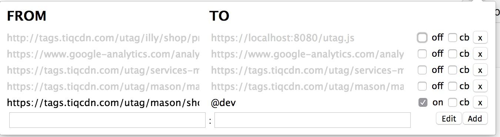

# switch-mod:

## Update 1.1:

### Shortcuts:

You can redirect utag.js files to corresponding env's by using `@dev, @qa or @prod`
in the rule.to section.

[rule.from]: https://tags.tiqcdn.com/utag/mason/shoemall/prod/utag.js
[rule.to]: @dev
[result]: https://tags.tiqcdn.com/utag/mason/shoemall/dev/utag.js

## Update 1.2:
1. rebuilt parsing engine for easier faster redirects.
